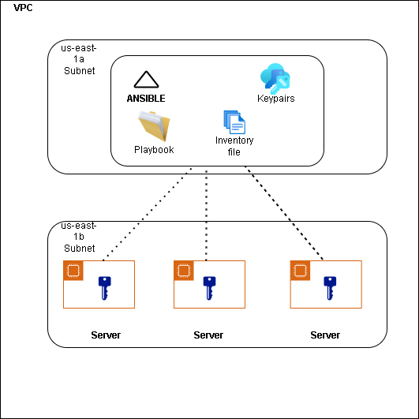
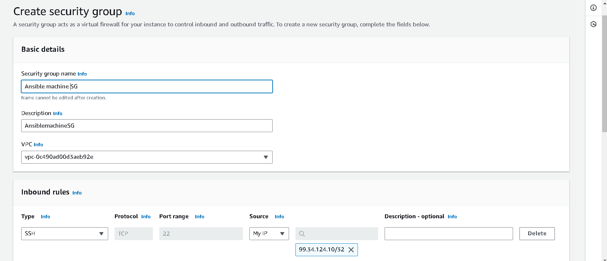
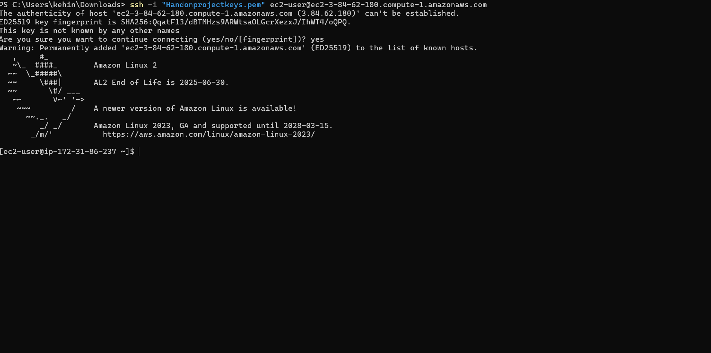
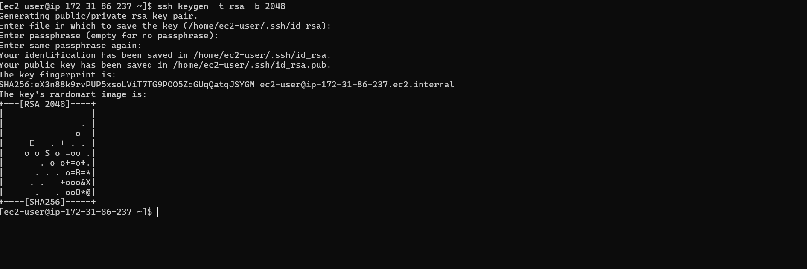
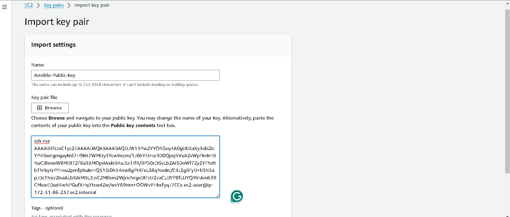
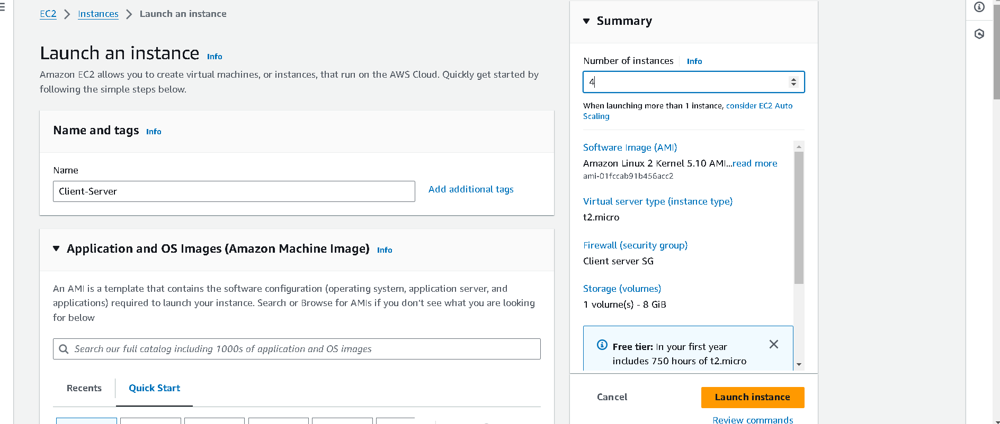
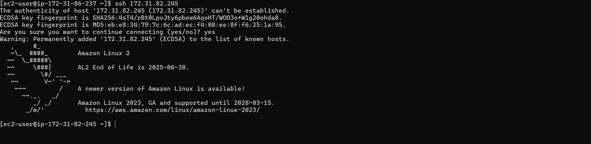
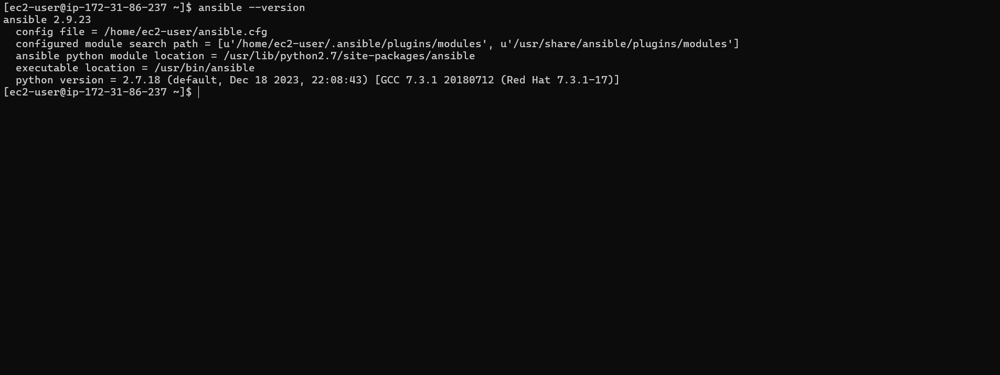
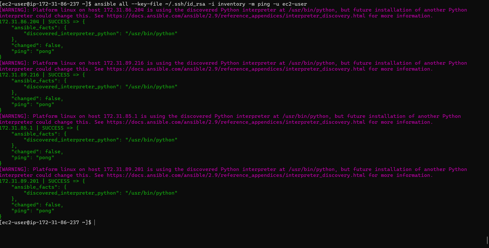
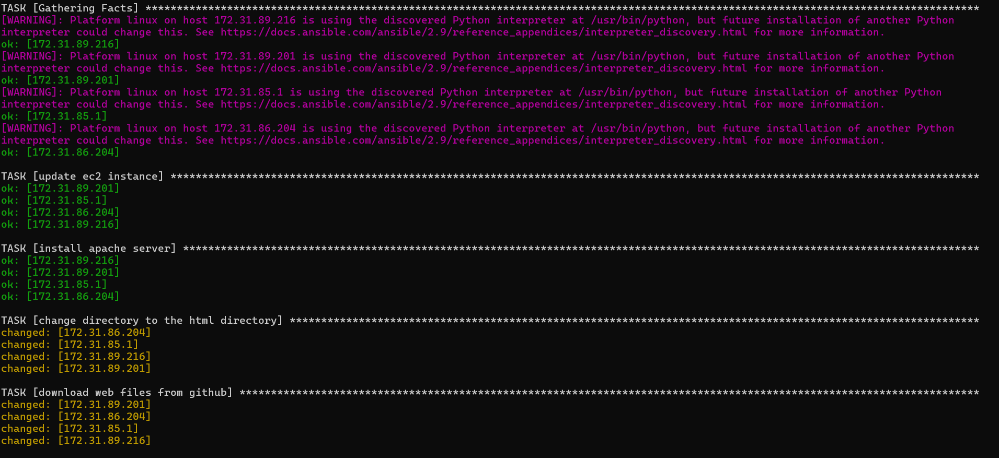

# Ansible_Project

# Ansible AWS Setup Project

This project demonstrates the use of Ansible to automate the setup and configuration of AWS EC2 instances. The steps include creating a security group, launching an EC2 instance to serve as the Ansible control node, and configuring additional EC2 instances.

## Overview

## Architecture Diagram



## Prerequisites

- An AWS account
- Ansible installed on your local machine

## Project Steps

### 1. Create a Security Group on AWS

- Create a security group in AWS that allows SSH (port 22) access.

  

### 2. Launch an EC2 Instance (Ansible Control Node)

- Launch an EC2 instance that will act as the Ansible control node.
- Ensure the instance is in the same security group created in step 1.

### 3. SSH into the EC2 Instance (Ansible Control Node)

- SSH into the newly launched EC2 instance using the key pair.



### 4. Create a Key Pair on the Ansible Machine
Generate a new SSH key pair on the Ansible control node.



### 5. Import the Public Key into the EC2 Instance in the Console



### 6. Launch 4 EC2 Servers and Test Connection

-Launch 4 additional EC2 instances to be managed by Ansible.

-Ensure they are in the same security group.



-Test SSH connection from the Ansible control node.



### 7. Install Ansible on the Ansible Machine
-Update the package index and install Ansible.
```bash
sudo yum update -y
sudo amazon-linux-extras install ansible2 -y
```


### 8. Create an Inventory File

-Create an inventory file that lists the EC2 instances.


### 9. Create a Playbook 

Create an Ansible playbook to automate tasks.
```yml
---

- name: deploy techmax website
  hosts: all
  become: yes
  become_user: root

  tasks:
    - name: update ec2 instance
      yum:
        name: "*"
        state: latest
        update_cache: yes

    - name: install apache server
      yum:
        name: httpd
        state: latest

    - name: change directory to the html directory
      shell: cd /var/www/html

    - name: download web files from github
      get_url:
        url: https://github.com/azeezsalu/techmax/archive/refs/heads/main.zip
        dest: /var/www/html/

    - name: unzip the zip folder
      ansible.builtin.unarchive:
        src: /var/www/html/techmax-main.zip
        dest: /var/www/html
        remote_src: yes

    - name: copy webfiles from the techmax-main directory to the html directory
      copy: 
        src: /var/www/html/techmax-main/
        dest: /var/www/html
        remote_src: yes

    - name: remove the techmax-main directory
      file: 
        path: /var/www/html/techmax-main
        state: absent

    - name: remove the techmax-main.zip folder
      file: 
        path: /var/www/html/techmax-main.zip
        state: absent 

    - name: start apache server, if not started
      ansible.builtin.service:
        enabled: yes
        name: httpd
        state: started
```


### 10.Create ansible.cfg File

-Create an Ansible configuration file to set defaults.


### 11. Test the Ansible machine
Execute the test on the EC2 instances.

```bash
ansible all --key-file ~/.ssh/id_rsa -i inventory -m ping -u ec2-user
```


### 12. Run the Ansible Playbook
Execute the playbook to configure the EC2 instances.



### Conclusion

This project demonstrates the automation of AWS EC2 instance setup using Ansible. By following the steps, you can efficiently manage multiple instances, ensuring they are configured consistently and correctly.


